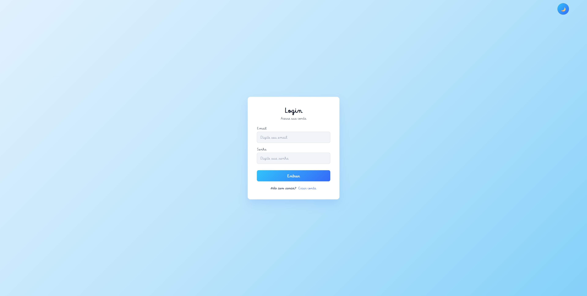
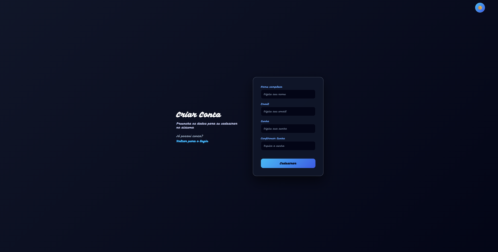
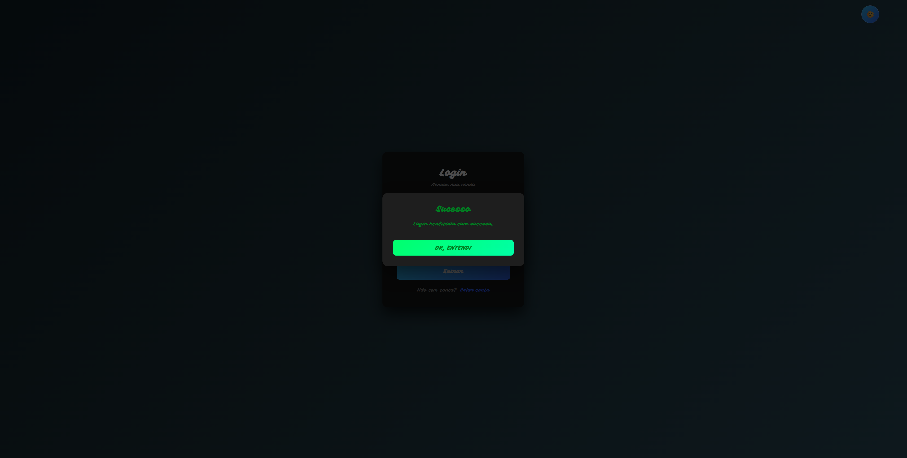
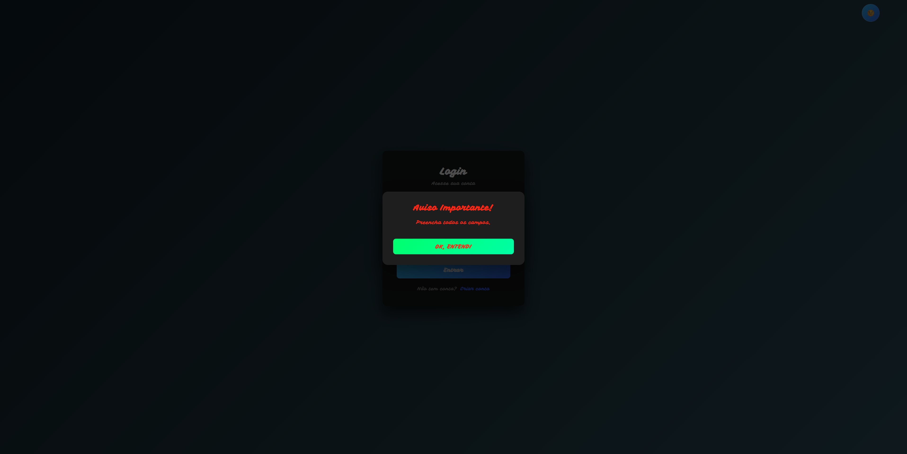

## Sobre o Projeto

O projeto **Login System** é uma aplicação web desenvolvida para demonstrar fluxos seguros de cadastro de usuários, autenticação, gerenciamento de sessões e integração backend. Construído com tecnologias web modernas e protocolos de segurança padrão de mercado, este projeto integra princípios fundamentais de tratamento de dados e serviços web.

---

## Principais Funcionalidades

- **Cadastro e Validação de Usuários**: Fluxo completo de criação de contas com validação no lado do cliente e do servidor.
- **Autenticação Segura**: Hash de senhas utilizando `bcrypt` para proteger as credenciais contra ataques de força bruta e tabelas arco-íris (*rainbow tables*).
- **Gerenciamento de Sessão e Tokens**: Manipulação segura de cookies e tokens para proteção de rotas autorizadas.
- **Interface Responsiva**: Layout limpo e moderno desenvolvido com HTML5, CSS3 e módulos interativos em JavaScript.
- **API Backend Robusta**: API RESTful construída com Node.js e Express.js, contando com configuração de CORS e middlewares de tratamento de requisições.
- **Integração com Banco de Dados**: Persistência de dados utilizando MongoDB (via Mongoose / driver nativo) para o armazenamento seguro de registros de usuários.

---

## Tecnologias Utilizadas

### **Backend**
- **Runtime**: [Node.js](https://nodejs.org/)
- **Framework**: [Express.js](https://expressjs.com/)
- **Segurança e Criptografia**: `bcrypt` / `bcryptjs`, JSON Web Tokens (`jsonwebtoken`)
- **Utilitários e Ambiente**: `dotenv`, `cors`, `nodemon` (desenvolvimento)

### **Frontend**
- **Marcação e Estilização**: HTML5, CSS Modular (`home.css`, `Login.css`, `Register.css`)
- **Lógica do Cliente**: JavaScript Vanilla (`Login.js`, `Register.js`, `modal.js`, `theme.js`)

### **Banco de Dados e Ferramentas**
- **Banco de Dados**: MongoDB / Fallback local em JSON (`users.json`)
- **Controle de Versão**: Git & GitHub

---

## Arquitetura do Projeto

```text
Projeto_Login_System/
├── backend/
│   ├── database/
│   │   └── users.json           # Armazenamento local de fallback / persistência
│   ├── routes/
│   │   └── auth.js              # Lógica de rotas de autenticação
│   └── server.js                # Ponto de entrada do servidor Express
├── frontend/
│   ├── CSS/
│   │   ├── home.css
│   │   ├── login.css
│   │   └── register.css
│   ├── js/
│   │   ├── login.js
│   │   ├── register.js
│   │   ├── modal.js
│   │   └── theme.js
│   ├── home.html                # Visão principal / Dashboard
│   ├── index.html               # Página inicial / Landing page
│   ├── register.html            # Tela de cadastro
│   └── src/                     # Recursos visuais (imagens, ícones)
├── package.json
└── .env.example
```
## 🖼️ Galeria do Projeto

<table>
  <tr>
    <td align="center" width="50%">
      <b>Tela de Login</b><br><br>
      
    </td>
    <td align="center" width="50%">
      <b>Tela de Cadastro</b><br><br>
      
    </td>
  </tr>
  <tr>
    <td align="center" width="50%">
      <b>Tela home </b><br><br>
      
    </td>
    <td align="center" width="50%">
      <b>Tela de sucesso</b><br><br>
      
    </td>
  </tr>
  <tr>
    <td align="center" colspan="2">
      <b>Tela de erro</b><br><br>
      
    </td>
  </tr>
</table>

## Começando

### Pré-requisitos
Certifique-se de ter instalado em sua máquina local:
- [Node.js](https://nodejs.org/) (versão 18 ou superior recomendada)
- [npm](https://www.npmjs.com/) (Node Package Manager)
- [Git](https://git-scm.com/)

### Instalação e Configuração

1. **Clone o repositório:**
   ```bash
   git clone https://github.com/larissalucasefg-web/Projeto_Login_System.git
   cd "Login System"
   ```

2. **Instale as dependências:**
   ```bash
   npm install
   ```

3. **Configure as Variáveis de Ambiente:**
   Crie um arquivo `.env` na raiz do projeto (ou dentro da pasta Backend conforme a configuração) e adicione as suas configurações:
   ```env
   PORT=3000
   MONGO_URI=sua_string_de_conexao_mongodb
   JWT_SECRET=sua_chave_secreta_jwt_super_segura
   ```

---

## 🏃 Executando a Aplicação

Para iniciar o servidor de desenvolvimento com recarregamento automático via `nodemon`:

```bash
npm run dev
```

Alternativamente, para iniciar em modo de produção padrão:
```bash
npm start
```

Abra o seu navegador e acesse:
`http://localhost:3001` (ou a porta especificada no seu arquivo `.env`).

---

## 🔌 Endpoints da API

| Método | Endpoint | Descrição | Corpo da Requisição (Body) |
| :--- | :--- | :--- | :--- |
| **POST** | `/api/auth/register` | Cadastra um novo usuário | `{ username, email, password }` |
| **POST** | `/api/auth/login` | Autentica as credenciais do usuário | `{ email, password }` |
| **GET** | `/api/auth/logout` | Encerra a sessão ativa do usuário | Nenhum |

---

## 🔒 Medidas de Segurança

- **Hash de Senhas**: Senhas em texto plano nunca são armazenadas no banco de dados. Processos de *salt* e *hash* são realizados utilizando algoritmos criptográficos padrão de mercado.
- **Proteção CORS**: Configurado para restringir o acesso de origens cruzadas não autorizadas.
- **Sanitização de Entradas**: Prevenção contra ataques de injeção por meio de validação rigorosa de carga (*payload*) nos endpoints.

---

## 👨‍💻 Autor

Desenvolvido como parte de projetos práticos e acadêmicos.

* **Estudante**: Larissa Lucas Tavares
* **Instituição**: Escola do Futuro Paulo Renato de Souza
* **Curso**: Técnico em Ciencia de Dados
* **Professor**: Heraclides Mourão